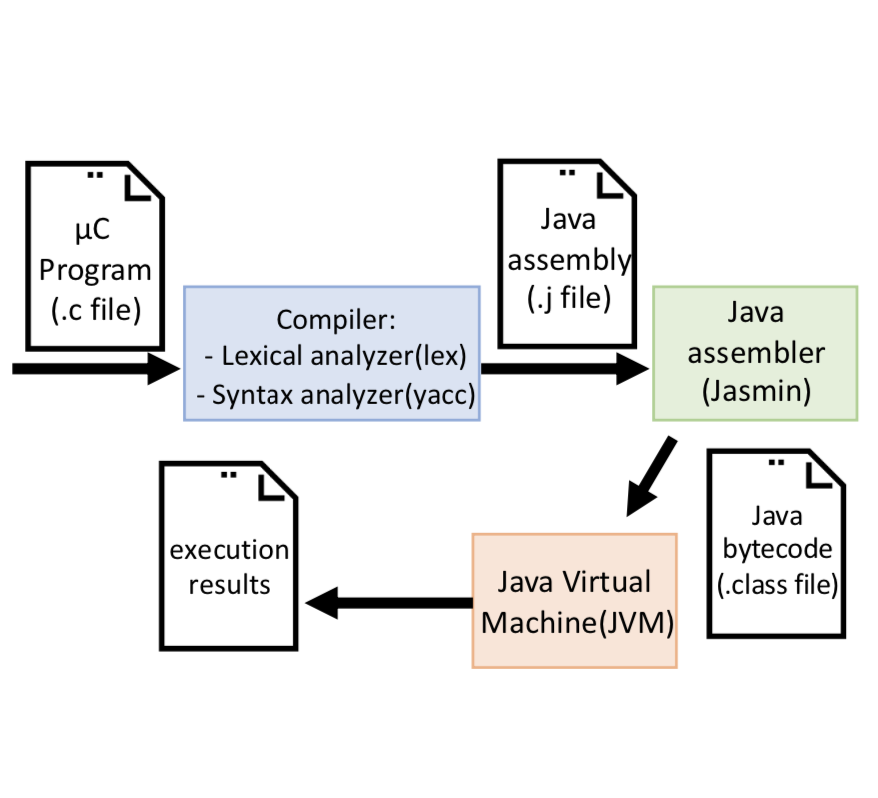

# compiler homework
## homework1
- make file
```make```
- run
```make basic_test```

## homework2
- make file
```make```
- run
```make test```
- result in ans1.out, ans2.out, ans3.out

## homework3

